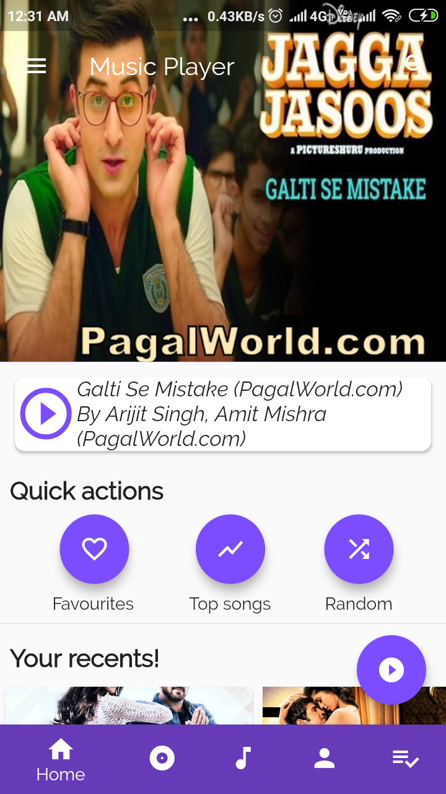
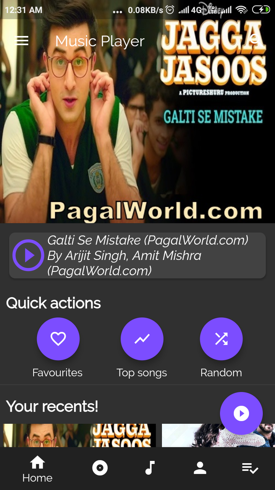
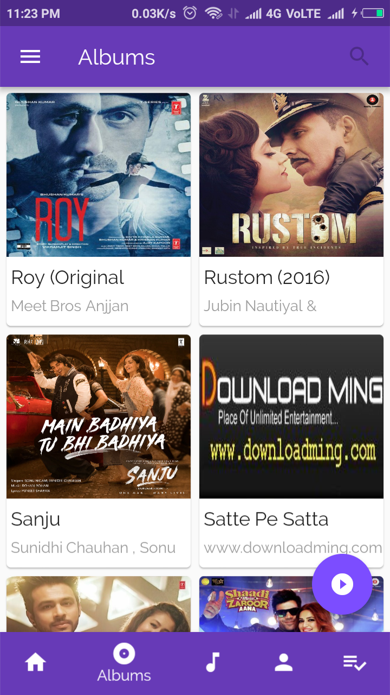
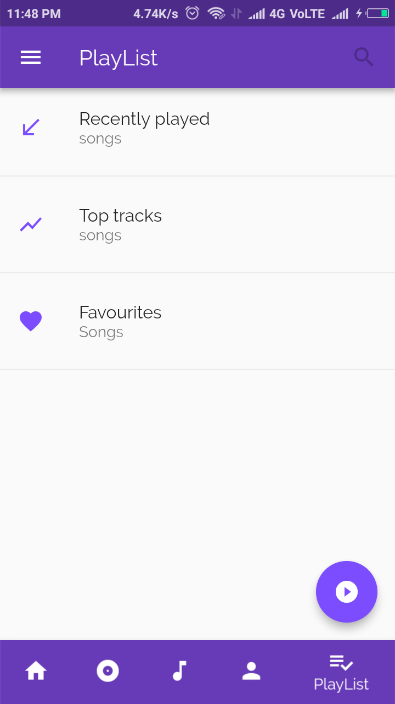
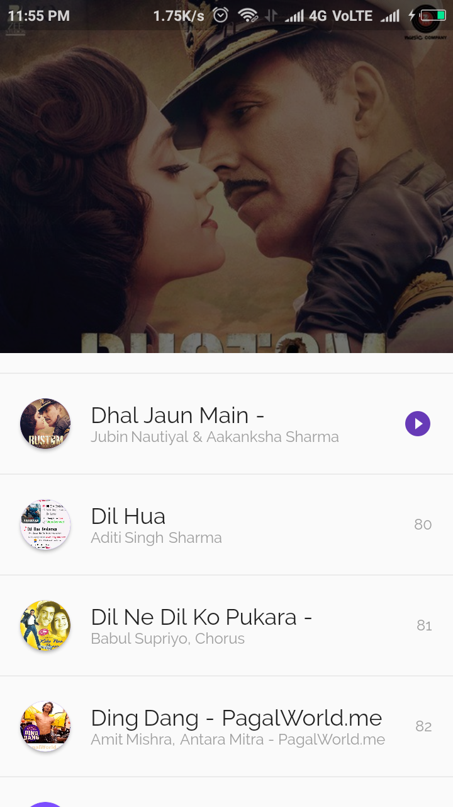
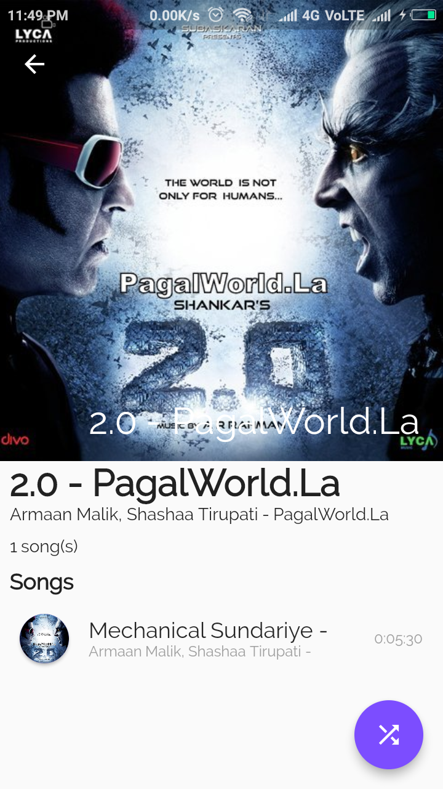
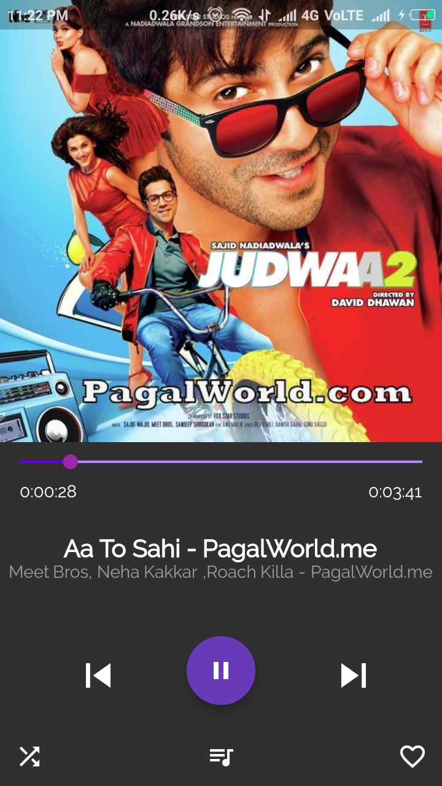
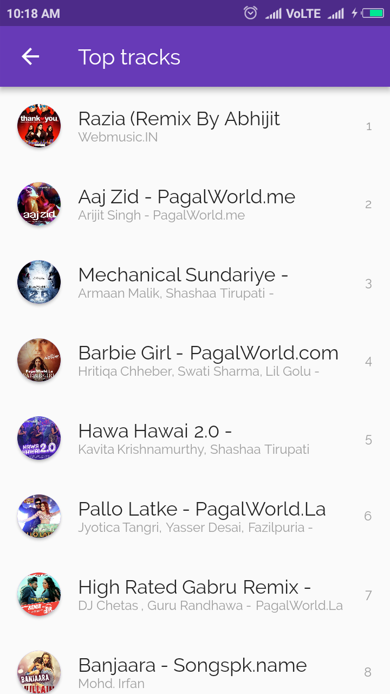

# Flutter Music Player

A complete and open source music player designed in flutter. It is first complete music player designed in flutter.
This app exploits Sqlite databse that enables faster loading of songs at startup. Only one time setup for loading songs is needed. This app comes with a lot of features and a more are coming soon.
 
 
You can download app from releases <a href="https://github.com/amangautam1/flutter-musicplayer/releases">Music Player</a>.

 
Please <b>star</b> the repo up, if you like the work.

# Features
<li> Play local songs
<li> Beautiful screens
<li> Sqlite database support
<li> Search songs, Songs suggestions
<li> Top tracks, Recent songs, Random song
<li> Album view, Artist view
<li> Playing queue, Shuffle, Add to favourites
<li> Play/pause, Next/prev
<li> Themes(dark/light), Custom font, Animations
<li> landscape mode

# Video
Catch the demo in this video. 

  
# Screenshots
<table>
  <tr>
    <td>
      
      Now playing
    </td>
    <td>
      
      Home Screen
      </td>
      <td>
      
         
     Dark Home Screen
      </td>
    </tr>
<!--   <tr>
      <td>
      
      Album
      </td>
    <td>
      
      Artist
      </td>
      <td>
      
      Songs
      </td>
    </tr>
  <tr>
      <td>
      
     PlayList
      </td>
      <td>
      
      Queue
      </td>
      <td>
      
     Album view
    </td>
    </tr>
  <tr>
       <td>
      
      Dark Now Playing
    </td>
      <td>
      
      Top tracks
      </td>
    <td>
      
      Landscape mode
    </td>
  </tr> -->
  </table>

# Plugins
Music player plugin used : <a href="https://github.com/iampawan/Flute-Music-Player">Flute-music</a>
 
For Sqlite :<a href="https://github.com/tekartik/sqflite">SQLite flutter plugin</a>

Note: This app may contain few bugs, which will be fixed shortly.

# Licence
MIT License

Copyright (c) 2018 Aman gautam

Permission is hereby granted, free of charge, to any person obtaining a copy
of this software and associated documentation files (the "Software"), to deal
in the Software without restriction for personal use, including without limitation the rights
to use, copy, modify, merge and/or publish copies of the Software, and to permit persons to whom the Software is
furnished to do so, subject to the following conditions:

The above copyright notice and this permission notice shall be included in all
copies or substantial portions of the Software.

THE SOFTWARE IS PROVIDED "AS IS", WITHOUT WARRANTY OF ANY KIND, EXPRESS OR
IMPLIED, INCLUDING BUT NOT LIMITED TO THE WARRANTIES OF MERCHANTABILITY,
FITNESS FOR A PARTICULAR PURPOSE AND NONINFRINGEMENT. IN NO EVENT SHALL THE
AUTHORS OR COPYRIGHT HOLDERS BE LIABLE FOR ANY CLAIM, DAMAGES OR OTHER
LIABILITY, WHETHER IN AN ACTION OF CONTRACT, TORT OR OTHERWISE, ARISING FROM,
OUT OF OR IN CONNECTION WITH THE SOFTWARE OR THE USE OR OTHER DEALINGS IN THE
SOFTWARE.

## Getting Started

For help getting started with Flutter, view our online
[documentation](https://flutter.io/).

## Donation
If this project help you reduce time to develop, you can give me a cup of coffee :) 

